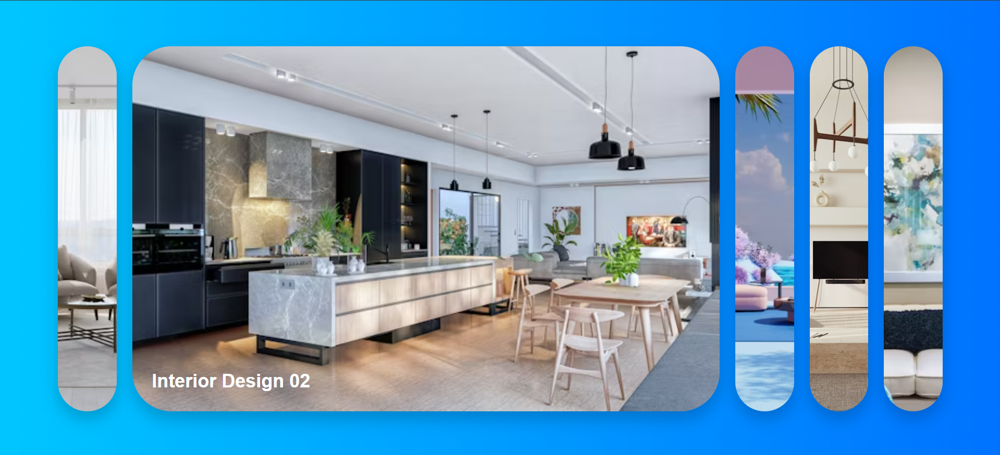
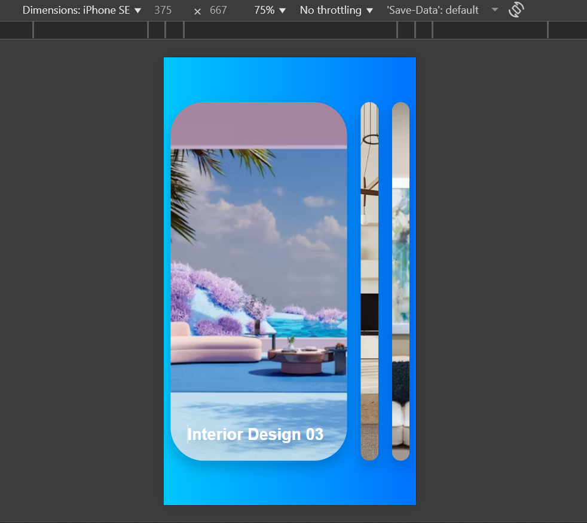

# 🖼️ Expanding Cards

A simple and interactive **Expanding Cards Project** built with **HTML, CSS, and JavaScript**.  
Click on a card to expand it and showcase **beautiful interior design images** with smooth transitions.  

---

## 🚀 Demo
👉 [Live Demo](https://vighnesh204.github.io/interior-design-gallery/)  

---

## 🛠️ Tech Stack

  
  
  

---

## 📸 Screenshot

---

## 📂 How to Use
1. Clone the repo  

   git clone https://github.com/vighnesh204/interior-design-gallery.git
